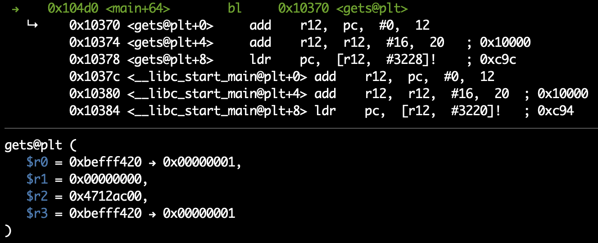

# スタックベースのバッファオーバーフロー

## はじめに

本章では、古典的なスタックベースのバッファオーバーフローについて見ていきます。Exploit 経験者であれば、本章の内容はx86 アーキテクチャなどと差異はほとんどないと思うでしょう。簡単にバッファオーバーフローの原理について紹介した後に、前章で作成したシェルコードを使ってシェルを奪う演習問題を解いていきます。バッファオーバーフローには、スタックバッファオーバーフローとヒープバッファオーバーフローの2つあります。本章では、前者について触れていきます。

## スタックバッファオーバーフローの原理

バッファオーバーフローは、予め設計されたバッファのサイズを超える読み込みを許容してしまう脆弱性のことです。Linux においてあるプロセスが実行されると、スタック領域が確保されローカル変数の領域として利用します。ここでは、このスタック領域でのバッファオーバーフローが起こる際の挙動について記載します。まずは以下のプログラムを見てみましょう（bof.c）。

```c
#include <stdio.h>
#include <stdlib.h>
int main(int argc, char* argv[]) {
    char buf[0x100];
    setbuf(stdout, NULL);
    printf("stack: %p\n", buf);
    gets(buf);
    return 0;
}
```

本プログラムでは、入力長さの長さを指定できない`gets` 関数を使用しています。意図されたバッファのサイズは0x100なので、これ以上の入力をすることでスタックの後続の領域を上書きすることが可能となります。スタックには、`return 0` で元の関数に戻るためのリターンアドレスが格納や関数内部のスタックのベースを示すフレームポインタが格納されています。本プログラムのスタックの使われ方を図示すると以下のようになります。図示されているアドレスはあくまで例です。

|アドレス|値|
|:---:|:---|
|0x1000| bufの値 |
|0x1100| フレームポインタ|
|0x1104| リターンアドレス|

上記の図より、0x100 を超える入力を行うことで、関数の戻り先であるリターンアドレスを上書きして制御を奪うことが可能となります。

まずgdbでgets関数の実行手前で止めて引数を確認します。gets関数の第1引数は、入力を保存するアドレスなので、r0レジスタの値を確認すると0xbefff420 であることがわかります。（上の図でいうところの0x1000）



次に、最後関数から戻る際の周辺の図が以下です。spの値が、0xbefff520 であることがわかります。ここから、`pop {r11, pc}` が実行されるため、0xbefff524に格納されている値がr11に、0xbefff528に格納されている値がpcに格納されることになります。つまり0x100 より大きい値を入力することで、フレームポインタやリターンアドレスを上書きすることができることわかります。


この時、戻り先をどこに書き換えればよいかという点が重要ですが、今回のプログラムでは、スタックのアドレスである`buf` 変数のアドレスをリークしてくれているため、このアドレスにジャンプすることで、入力したシェルコードを実行することが可能となります。ただし、最近のgcc などでは、スタック領域など読み書きすることのみを想定された領域では、実行権限が付与されていないため通常では入力したシェルコードを実行することができません。今回は、gcc のセキュリティ機構を無効にした状態でコンパイルすることで、実行権限を付与しているため本攻撃が通用します。gef では、対象ファイルを選択した状態であれば、`checksec` コマンドを使うことでセキュリティ機構を確認できます。

```bash
$ gdb -q bof
gef➤  checksec
[+] checksec for '/home/pi/ARM_Exploit/docs/chapter02/bof'
Canary                        : No
NX                            : No
PIE                           : No
Fortify                       : No
RelRO                         : Partial
```

ここで、NXがNoになっている場合、スタックなどの実行権限は付与されていません。また、Canaryは、スタックベースのバッファオーバーフローを防ぐgcc のSSP（Stack Smashing Protection）と呼ばれる機構が有効であるか否かを示しています。先程の図を使うと、以下のようにフレームポインタの手前にCanary と呼ばれる値を保持しており、これが書き換わると強制終了する関数を呼ぶ処理が実行されるようになります。

|アドレス|値|
|:---:|:---|
|0x1000| bufの値 |
|0x1100| Canary |
|0x1104| フレームポインタ|
|0x1108| リターンアドレス|

Canary については、更に後の章で詳しく扱っていきます。

## 演習問題

では、ここまでの説明を踏まえてバッファオーバーフローを用いてシェルコードを実行させることで、シェルを奪取します。前章と同じようにsocat を用いてバイナリを8888/tcp で待ち受けてください。

```bash
$ socat tcp-l:8888,reuseaddr,fork exec:./bof
```
