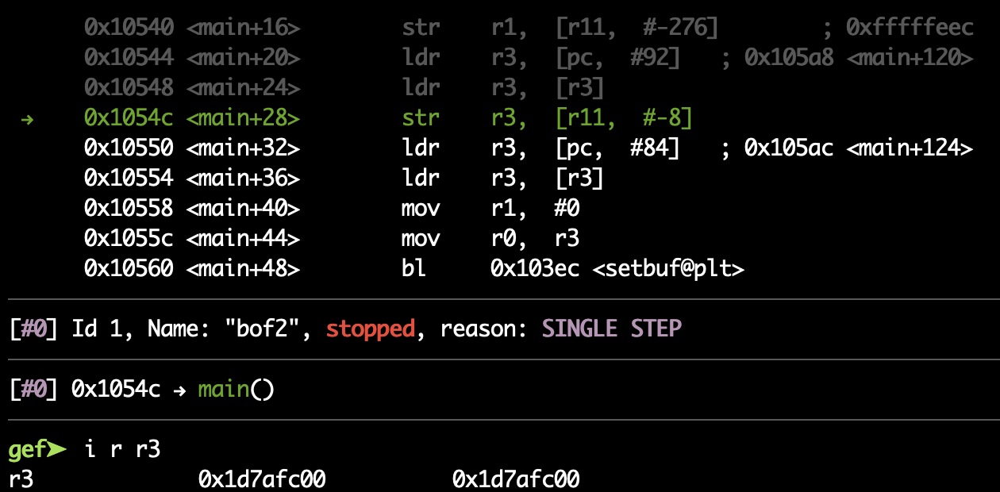

# 4. Playing with Canary

この章では、2章で少し頭出しをしたCanary についてもう少し深く見ていきます。Canary は、SSP によるBuffer Overflow を検知するための値です。x86においてCanaryは、`fs:[0x28]` に格納されており、読み出すには若干手間がかかります。しかしながら、ARM においては別の場所に格納されています。本章ではARM におけるCanaryの特徴を簡単にご紹介します。

## 4.1 ARM におけるCanary

まずは、`bof2` をgefで読み込んで、`start` コマンドを入力してください。`bof2` は、SSPを有効にした状態でコンパイルしています。
SSP では、関数の先頭で、Canaryをスタックに配置する処理を行います。ここではその様子を見ていきます。

ここで、`ldr` 命令により、0x105a8の値をr3レジスタにロードしようとしています。さらに、r3レジスタをアドレスとして指す値を、r3レジスタに格納しようとしています。その後、`str` 命令によって、r3レジスタの値を、`[r11, #-8]` つまりフレームポインタ-8のアドレスに格納しようしています。この時、r3レジスタにはどんな値が入っているか確認するために、`si`命令で2命令勧めて、`i r r3` でr3レジスタの値を確認してみましょう。

r3 レジスタには、0x1d7afc00という値が入っていることが確認できました。Canary の末尾1byteがNULL バイトであるという特徴にマッチしています。実は、この値がCanaryになっています。ここまで見てきたようにCanaryの値の元は、0x105a8に入っていました。このアドレスは、どこのセクションに位置するのか確認してみましょう。こういった際には、`xinfo` コマンドが便利です。

xinfoの結果よりから、0x105a8は.textセクションに位置していることがわかりました。これは、つまりASLR の影響を受けないことを意味しています。また、ROPなどでリークが簡単にできるアドレスに格納されているため、他の脆弱性と合わせることで、Canary をリークすることが可能となります。

最後にCanary の比較処理を見てみましょう。main+88の周辺を見てみましょう。

最初の命令では、0x105a8から値をr3レジスタにロードしています。次に、Canaryを保存していた`[r11, #-8]`からr2レジスタに値をロードしています。その後、r3レジスタをアドレスとして指す値をr3レジスタにロードしています。これにより、元のCanaryの値をr3レジスタに格納できます。その後、`cmp` 命令で、スタック上のCanaryであるr2と、元のCanaryであるr3レジスタを比較して、等しければ`<main+112>`にジャンプ（`beq`は等しければジャンプする）し、終了処理に向かいます。しかし等しくなければ、`stack_chk_fail` という強制終了処理が走る関数を実行します。

## 4.2 まとめ

本章では、ARM におけるCanaryについて見てきました。ARM のCanaryの値は、`.text` セクションに格納されているため、他の脆弱性と組み合わせることで、Canaryをリークして、SSP をバイパスすることが可能となります。これは、x86系と異なる仕組みなのでARM Exploit開発をする上で重要な知見だといえます。
